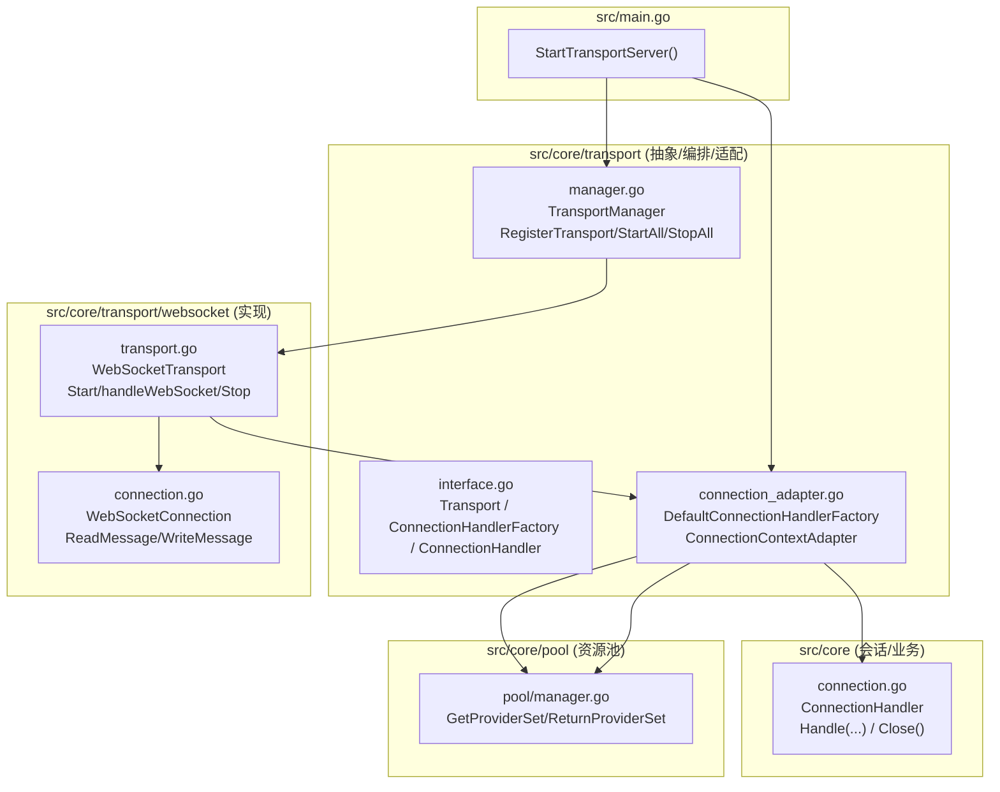

# Transport 模块技术文档

本文档聚焦 `src/core/transport/` 这层的职责、与 `src/core/transport/websocket/*` 的关系、以及从“服务启动 → 新连接接入 → 进入会话层(core)”的调用时序。

> 结论先说：`transport/` 是“传输层抽象 + 通用编排/适配”，`transport/websocket/` 是“WebSocket 具体实现”。业务会话/协议处理在 `src/core/connection.go`。

## 1. 目录与文件职责

`src/core/transport/`（抽象/编排/适配）：
- `interface.go`：定义传输层统一抽象 `Transport`、`ConnectionHandlerFactory`、`ConnectionHandler`，以及复用的 `Connection` 类型别名。
- `manager.go`：`TransportManager`，负责注册多个 transport，并统一启动/停止/统计。
- `connection_adapter.go`：
  - `DefaultConnectionHandlerFactory`：把“网络连接”变成“业务 handler”，并从资源池申请 providerSet。
  - `ConnectionContextAdapter`：连接生命周期胶水，负责 cancel ctx、关闭 handler、关闭 conn、归还 providerSet（非常关键）。

`src/core/transport/websocket/`（WebSocket 具体实现）：
- `transport.go`：`WebSocketTransport`，监听端口、Upgrade、维护活跃连接表、Stop 时关闭连接。
- `connection.go`：`WebSocketConnection`，对 gorilla websocket 的读写做统一封装，提供线程安全写、最后活跃时间等。

## 2. 分层关系图（等价“截图”）



读图要点：
- `WebSocketTransport` 不直接依赖 `core.ConnectionHandler`，它只依赖抽象 `ConnectionHandlerFactory`。
- 业务 handler 的创建与资源池绑定发生在 `connection_adapter.go`，而不是发生在 `websocket/transport.go`。
- 这样未来加新传输（MQTT/UDP）时，只需要新增 `transport/<impl>`，复用 `connection_adapter.go` 的通用逻辑即可。

## 3. "启动 → 接入 → 进入会话层"的时序图（树状层级展开）

> 读图要点（按真实调用顺序）：
> 1. `main.StartTransportServer` 创建 `DefaultConnectionHandlerFactory`，并通过 `WebSocketTransport.SetConnectionHandler(factory)` 注入进去。
> 2. `WebSocketTransport.Start` 开始监听端口。
> 3. 新连接到来时，`handleWebSocket` 完成 Upgrade，并创建 `WebSocketConnection`（实现 `core.Connection`）。
> 4. `handleWebSocket` 调 `factory.CreateHandler(conn, req)`：
>    - 从资源池借一套 providerSet（ASR/LLM/TTS/VLLLM/MCP）。
>    - 创建真正的业务会话处理器 `core.ConnectionHandler`。
>    - 用 `ConnectionContextAdapter` 包一层，负责 Close 时归还资源池。
> 5. `handleWebSocket` 启动 goroutine 执行 `adapter.Handle()`，内部进入 `core.ConnectionHandler.Handle(conn)` 会话主循环。
> 6. 连接断开/停止时，`handleWebSocket` 的 defer 会调 `adapter.Close()`：cancel ctx、关闭业务 handler、关闭 conn、归还 providerSet。

```
启动阶段
└── main.StartTransportServer
    ├── NewPoolManager
    ├── NewTaskManager
    ├── NewTransportManager
    ├── NewDefaultConnectionHandlerFactory
    ├── NewWebSocketTransport
    │   └── SetConnectionHandler(factory)
    └── transportManager.StartAll
        └── WebSocketTransport.Start
            └── http.ListenAndServe
                │
                ▼ 新连接到来
            ┌─ handleWebSocket
            │   ├── upgrader.Upgrade
            │   ├── 解析 Header
            │   └── NewWebSocketConnection
            │       │
            │       ▼ 创建 Handler
            │   factory.CreateHandler(conn, req)
            │   ├── poolManager.GetProviderSet (借资源)
            │   └── NewConnectionContextAdapter
            │       │  (包装业务 Handler + 资源归还逻辑)
            │       │
            │       ▼ 启动会话处理
            │   go handler.Handle()
            │       │
            │       ▼ 进入会话主循环
            │   ConnectionHandler.Handle(conn)
            │   ├── processClientAudioMessagesCoroutine (处理音频)
            │   ├── processClientTextMessagesCoroutine (处理文本)
            │   ├── processTTSQueueCoroutine (TTS 队列)
            │   └── sendAudioMessageCoroutine
            │       └── loop: ReadMessage → 分发处理
            │
            ▼ 连接断开 / Stop
        adapter.Close() (defer 调用)
            ├── cancel ctx (取消所有协程)
            ├── handler.Close (关闭业务 Handler)
            ├── conn.Close (关闭 WebSocket 连接)
            └── poolManager.ReturnProviderSet (归还资源池)
```

代码定位（建议从上到下读）：
- `src/main.go:114`：`StartTransportServer`（创建 factory、注册 websocket transport）
- `src/core/transport/websocket/transport.go:39`：`WebSocketTransport.Start`
- `src/core/transport/websocket/transport.go:105`：`WebSocketTransport.handleWebSocket`
- `src/core/transport/connection_adapter.go:170`：`DefaultConnectionHandlerFactory.CreateHandler`
- `src/core/connection.go:536`：`core.ConnectionHandler.Handle`（会话主循环）
- `src/core/transport/connection_adapter.go:70`：`ConnectionContextAdapter.Close`（归还资源池）

## 4. 客户端协议（hello/listen/tts）的消息时序图

这张图只画“客户端能观察到”的帧：
- TextFrame：JSON 消息（hello/listen/stt/tts/abort 等）
- BinaryFrame：音频数据（上行用户语音、下行 TTS 音频）

关键约定：
- `hello` 用来协商音频参数，服务端会回 `session_id` 与“下行音频参数”。
- 一轮语音对话通常是：`listen.start` → 多个音频 BinaryFrame → `listen.stop`。
- 服务端下行通常是：`stt` → `tts.start` → N 次 `sentence_start + 音频帧 + sentence_end` → `tts.stop`。
- `abort` 会让服务端停止说话并下发 `tts.stop`（客户端应立即停止播放队列）。

代码定位（从协议入口到下行消息）：
- `src/core/connection_handlemsg.go:115`：`handleHelloMessage`
- `src/core/connection_sendmsg.go:12`：`sendHelloMessage`
- `src/core/connection_handlemsg.go:156`：`handleListenMessage`
- `src/core/connection.go:633`：`OnAsrResult`（ASR 回调触发对话）
- `src/core/connection_sendmsg.go:62`：`sendSTTMessage`
- `src/core/connection_sendmsg.go:42`：`sendTTSMessage`
- `src/core/connection_sendmsg.go:183`：`sendAudioFrames`（按帧节流下发）
- `src/core/connection.go:668`：`clientAbortChat`

```text
Client                                      Server(core)
  │                                             │
  │ hello(audio_params) ────────────────────────►│ handleHelloMessage
  │                                             ├─ sendHelloMessage()
  │◄──────────────── hello(session_id, params) ─┘
  │
  │ listen(start, mode=auto) ───────────────────►│ handleListenMessage
  │ binary audio frame (pcm/opus) ─────────────►│ ASR.AddAudio (queue)
  │ ...                                         │
  │ listen(stop) ───────────────────────────────►│ ASR.SendLastAudio([])
  │                                             │
  │                                             ├─ OnAsrResult(text)
  │◄────────────────────────── stt(text) ───────┤
  │◄──────────────────── tts(state=start) ──────┤
  │                                             │
  │                                             ├─ 分句 #1
  │◄──────── tts(sentence_start, idx=1, text) ──┤
  │◄────────────── binary tts frame (opus) ─────┤ (N frames)
  │◄──────────── tts(sentence_end, idx=1) ──────┤
  │                                             ├─ 分句 #2 ...
  │◄───────────────────── tts(state=stop) ──────┘
  │
  │ abort ──────────────────────────────────────►│ clientAbortChat
  │◄───────────────────── tts(state=stop) ──────┘
```

### 4.1 服务端内部并发管线（LLM → 分段 → TTS → 发帧）

这张图按 goroutine + channel 的方式画出“LLM 流式输出如何变成可播放音频”的真实路径：
- “segCh” 对应 `ttsQueue`
- “发送 opus 帧” 对应 `sendAudioFrames`（在音频发送 goroutine 内执行）

```text
LLM(genResponseByLLM) goroutine             ttsQueue(segCh)              TTS goroutine                 audioMessagesQueue            Sender goroutine
        │                                        │                            │                               │                         │
        │ responses := llm.ResponseWithFunctions │                            │                               │                         │
        │ for response in responses:             │                            │                               │                         │
        │  ├─ append content                     │                            │                               │                         │
        │  └─ 分段(SplitAtLastPunctuation)       │                            │                               │                         │
        │        └─ seg ────────────────────────►│  ────────────────────────► │ 读取 seg                      │                         │
        │                                        │                            │   │                           │                         │
        │                                        │                            │   └─ tts.ToTTS(seg)           │                         │
        │                                        │                            │        └─ filepath ──────────►│  ──────────────────────►│ 读取 filepath
        │                                        │                            │                               │                         │   │
        │                                        │                            │                               │                         │   ├─ sendTTSMessage(sentence_start)
        │                                        │                            │                               │                         │   ├─ sendAudioFrames(opus/pcm frames)
        │                                        │                            │                               │                         │   └─ sendTTSMessage(sentence_end/stop)
        ▼                                        ▼                            ▼                               ▼                         ▼
```

## 5. 常见困惑澄清

### 5.1 为什么 `WebSocketTransport` 不直接 new `core.ConnectionHandler`？

为了把“网络接入层”与“业务会话层”解耦：
- `websocket/*` 只关心网络连接与生命周期；
- `connection_adapter.go` 统一注入资源池、ctx、回调等共性；
- `core.ConnectionHandler` 只关心协议与对话业务。

这样未来加 `mqtt_udp` 传输时，只需要实现一个 `Transport`，复用工厂与 adapter，不需要复制一份 ASR/LLM/TTS 绑定/归还逻辑。

### 5.2 `clientID`、`session_id`、`deviceID` 是一回事吗？

不是：
- `clientID`：当前 WS 连接在 `WebSocketTransport` 中的 key（`activeConnections` 用它索引）。
- `session_id`：协议层会话标识，`core.NewConnectionHandler` 会从 header 读取或基于 `deviceID` 生成。
- `deviceID`：设备唯一标识（用于绑定 agent/device）。

如果你需要“跨重连保持同一个会话”，你应该稳定提供 `Device-Id`（服务端会用它派生 `session_id`）。
